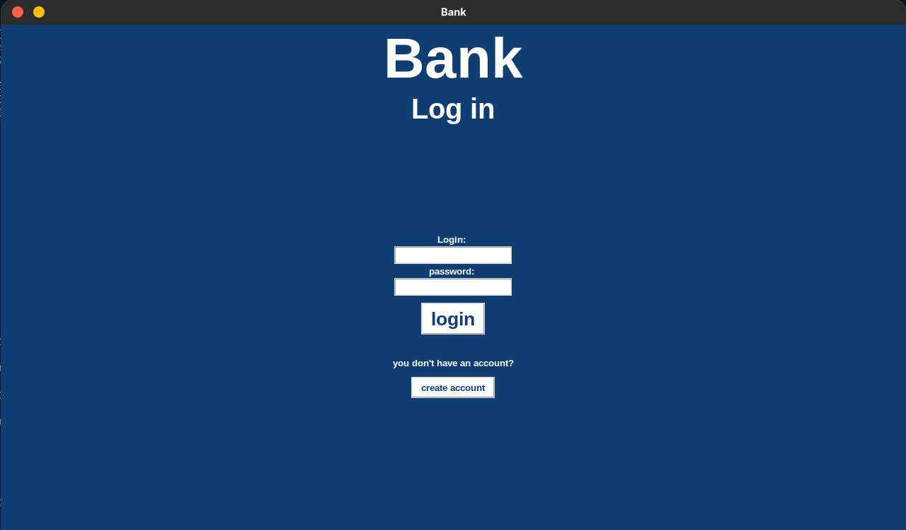
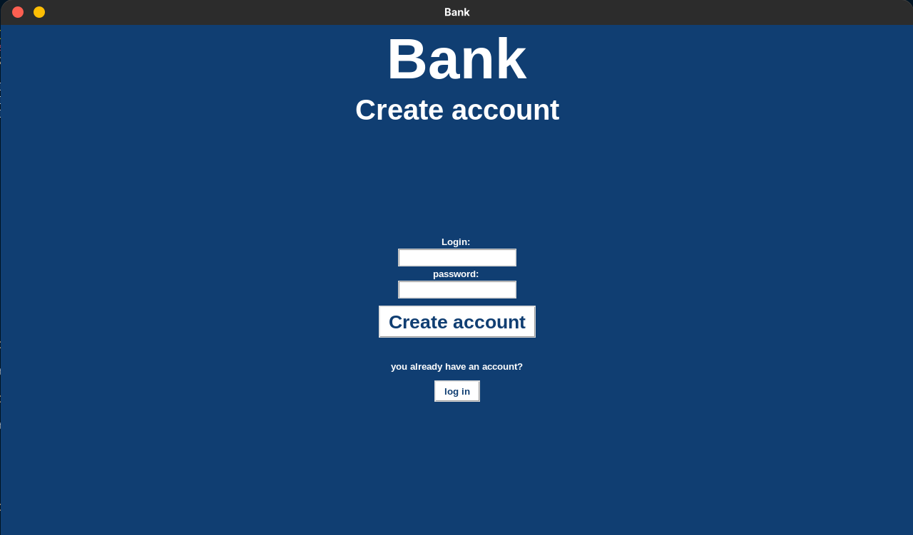
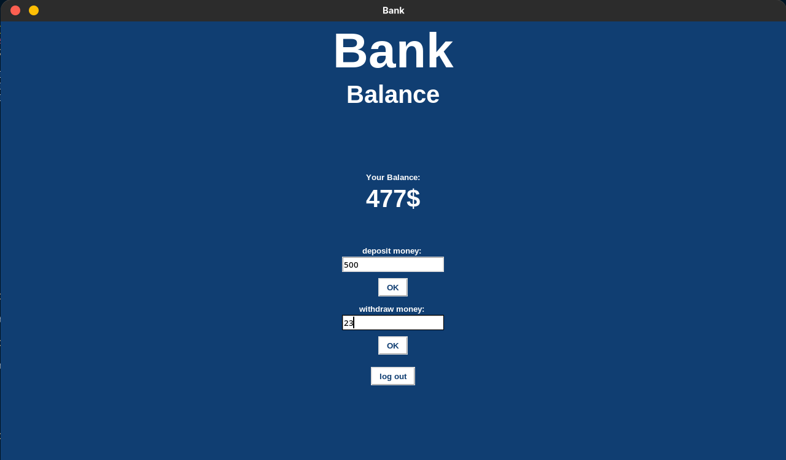

# Bank

Bank is a simple program with GUI that imitates a banking application that is connected to a database and we can log in to our account or register a new account, after logging in we can add or withdraw money.

## Functions
- account registration
- account login
- deposit money
- withdraw money

## Technology
- python
- sqlite 3
- tkinter

## Requirements
- python 3.x

## Installation
- install the bank.py file
- then open a terminal and go to the folder where you downloaded bank.py
- run the program with command python bank.py

## Use

- To log in, you must enter your login and password, then click the login button if the account exists and the information is correct.
- if you do not have an account, click on the register button.
  &nbsp;

&nbsp;

- To create an account, enter your details and press the register button.
- After creating an account, press the login button and log in to your newly created account.

&nbsp;

- For deposit enter the value in the field and then press the OK button under the deposit field.
- To withdraw money, enter the value in the withdraw field and then press the OK button below the withdraw field.
- To log out, press the log out button.

## Author
Mykhaylo Stefinin
- email: mykhaylo.stefinin@gmail.com
