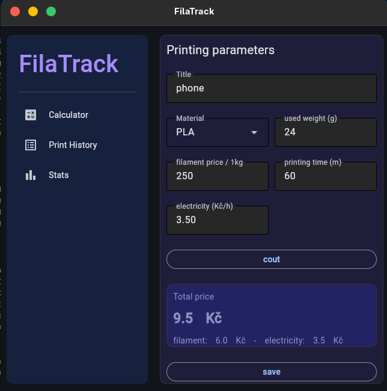
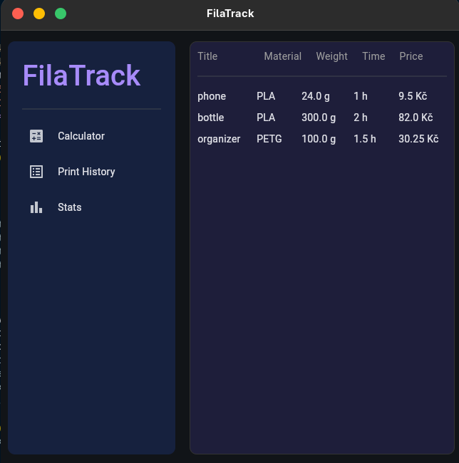
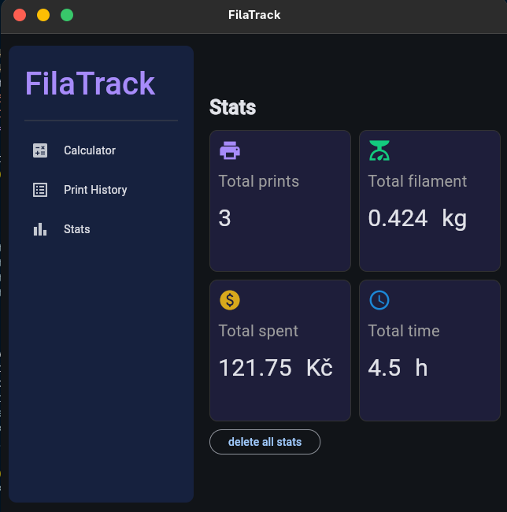

# FilaTrack

FilaTrack is an application with a GUI for calculating the cost of 3D printing, saving all prints in the print history and displaying printing statistics over time.

## Functions
- calculating printing cost
- saving prints to history
- statistics

## Technology
- python
- sqlite 3
- flet 

## Requirements
- python 3.x
- Flet

## Installation
- install the FilaTrack.py file
- then open a terminal and install flet with command: pip install flet
- in terminal go to the folder where you downloaded FilaTrack.py
- run the program with command: python FilaTrack.py

## Use

- Enter the appropriate data in the field.
- To calculate the price after entering the data, press the count button.
- To save this printout to history, press the save button.
  &nbsp;

&nbsp;

- To go to history page you have to click the history icon in the left menu.
  &nbsp;

&nbsp;

- To go to the stats page you have to click the stats icon in the left menu.
- To delete all history and stats, you must press the delete all stats button. ATTENTION! after deleted, data cannot be restored.
  &nbsp;

## Author
Mykhaylo Stefinin
- email: mykhaylo.stefinin@gmail.com
